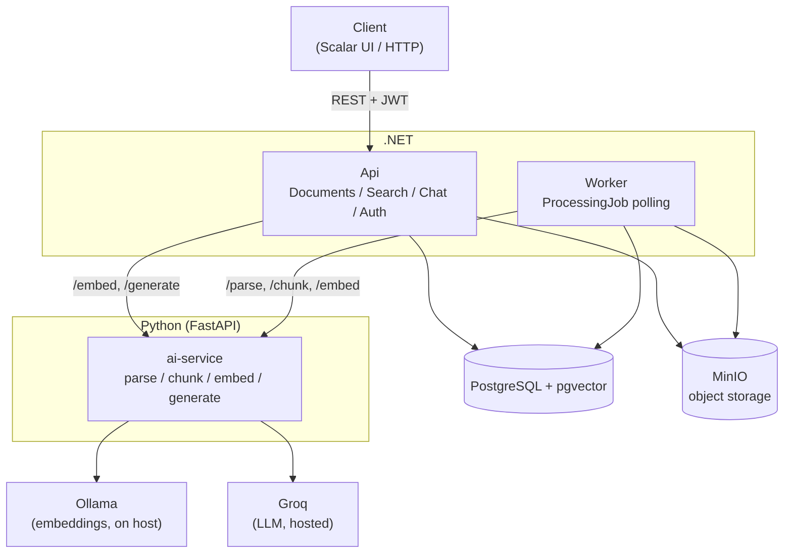

# SmartDoc

**AI-powered document intelligence platform.** Upload PDFs, ask questions in natural
language, get answers grounded in the documents themselves — with citations back to the
exact file and page.

Portfolio project (PoC), not a commercial product. The goal is to demonstrate a
production-oriented backend architecture with AI as a real production component — async
processing, semantic search, RAG, observability, tests — not a demo of "I can call an LLM
API".

```
Upload a PDF → background worker parses/chunks/embeds it → ask a question in plain English
→ the system retrieves the relevant chunks → an LLM answers, citing "file.pdf — page 12"
```

## Table of contents

- [Architecture](#architecture)
- [Why these choices](#why-these-choices)
- [RAG strategy](#rag-strategy)
- [Tech stack](#tech-stack)
- [Getting started](#getting-started)
- [API](#api)
- [Testing](#testing)
- [Observability](#observability)
- [Project status](#project-status)
- [Known limitations](#known-limitations)
- [Architecture decisions](#architecture-decisions)

## Architecture

Modular monolith in .NET, with a stateless Python service for the AI-specific parts of the
pipeline. Deliberately not microservices — the complexity isn't justified at this scale (see
[ADR 0002](docs/decisions/0002-dev-environment-docker-wsl2.md) and the trade-offs below).



`Api` and `Worker` never call an LLM/embedding provider directly — only `ai-service` does,
behind `ILlmProvider`/`EmbeddingProvider` abstractions on each side of the language boundary
(see [§ Why provider abstraction](#why-provider-abstraction-for-llmembeddings)).

### .NET ↔ Python contract

Python is intentionally **stateless** — it never touches the database. The split is always
the same:

1. `.NET` calls `Python /embed` to vectorize a question (or a document chunk, from the
   Worker).
2. `.NET` runs the similarity search itself, directly against `pgvector` — Python never sees
   the database.
3. `.NET` builds the context (top-K chunks + citation metadata) and calls `Python /generate`
   with the question and that context already assembled.
4. `Python` returns the generated text; `.NET` appends the citations from its own retrieval
   metadata (`FileName`/`PageNumber`) and persists/returns the full answer.

Citations are never left to the LLM to get right — `.NET` builds the "Sources:" block itself
from data it already has, rather than trusting the model to cite accurately.

### Document processing

```
POST /api/documents → validate (PDF only) → store file in MinIO → create Document (Uploaded)
                     → create ProcessingJob (Pending) → 202 Accepted, no waiting
```

```
Worker polls ProcessingJobs → parse (ai-service) → chunk (ai-service) → embed (ai-service)
       → persist DocumentChunks + vectors → Document = Ready
```

The API never blocks on processing — upload returns as soon as the file is stored and a job
is queued, which is the actual point of the Job/Worker pattern here, not a CRUD wrapped
around an LLM call.

## Why these choices

**.NET + Python, not one or the other.** .NET for the API, domain, auth, persistence and job
orchestration — Python for the AI-specific slice (PDF parsing, chunking, embedding/LLM
provider calls), where its ecosystem is genuinely the better tool. Python is kept stateless
and internal-only so the split doesn't leak into a second source of truth.

**PostgreSQL + pgvector, not a dedicated vector database.** Keeps transactional data and
vector search in a single system instead of adding Pinecone/Weaviate/Elasticsearch for a PoC
that doesn't need their scale. Similarity search uses pgvector's cosine operator (`<=>`) with
an HNSW index (see [ADR 0019](docs/decisions/0019-pgvector-hnsw-index.md)) — chosen over
`ivfflat` specifically because this table starts empty and grows one document at a time,
which `ivfflat`'s k-means-based index build handles badly.

**Async processing, not a synchronous upload-and-wait endpoint.** Upload returns
`202 Accepted` immediately; a `BackgroundService` + `ProcessingJobs` polling table does the
actual work. No Hangfire/Quartz — a `PENDING/RUNNING/DONE/FAILED` status column and a
polling loop is enough at this scale, with dashboards/advanced retry scheduling left as an
explicit post-MVP evolution rather than pulled in speculatively.

**Provider abstraction for LLM/embeddings.** Neither the LLM nor the embedding model is
hardcoded into business logic — `IEmbeddingProvider`/`ILlmProvider` (and their Python
equivalents) sit behind the AI service's routers, selected by config. Currently: Groq for
generation, Ollama (local, `nomic-embed-text`) for embeddings — chosen for cost, not locked
in by design. Swapping either is a new provider implementation plus config, not a rewrite of
`/generate` or `/embed`'s callers. (The abstraction exists; running multiple providers
concurrently does not — that's out of scope by design, see
[Known limitations](#known-limitations).)

**A modular monolith, not microservices.** Two deployable units (.NET, Python) is already
the amount of distribution this project's actual scale justifies. Kubernetes, message
queues and multi-service orchestration would demonstrate operational complexity for its own
sake here, not a real requirement — see the [Qué NO hacer](CLAUDE.md#qué-no-hacer-scope-guard)
scope guard this project holds itself to throughout.

## RAG strategy

```
Question → embed(question) → cosine similarity search (pgvector, HNSW)
         → top-K chunks below distance threshold → build context → LLM → answer + citations
```

| Parameter | Value | Notes |
|---|---|---|
| Chunk size | 500 tokens | Estimated with `tiktoken` (`cl100k_base`) as a provider-agnostic approximation — no embedding model here actually uses that tokenizer. |
| Chunk overlap | 75 tokens | Chunks never cross a page boundary, even mid-overlap — needed so citations can always say "page N" unambiguously. |
| Top-K | 5 (default), configurable up to 50 | Set per-request on `POST /api/search`/`POST /api/chat`. |
| Similarity threshold | `0.33` (cosine distance) | Empirically calibrated, not a guess — see [ADR 0022](docs/decisions/0022-rag-threshold-calibration.md): 45 ground-truth questions across 6 real PDFs, run through `/api/search` directly to get raw distances. Chosen for zero false positives among out-of-scope questions at 91.7% recall on in-scope ones — a wrong citation was judged more costly than an extra "I don't have enough information" refusal. |
| Embedding model | `nomic-embed-text` (768 dim) | Via Ollama, running on the host — the dimension is fixed in the schema; changing models means a migration and re-embedding everything, not a config swap. |
| Generation model | `openai/gpt-oss-120b` via Groq | Chosen over local Ollama for `/generate` specifically: Ollama measured 40s+ for a short completion (~0.87 tok/s on a 14B model) vs. Groq's ~0.5s — unacceptable for a synchronous, user-facing endpoint, even though Ollama's latency is fine for `/embed`, which runs in the background. |

If nothing clears the threshold, `.NET` returns "insufficient context" without ever calling
`/generate` — saving the LLM call entirely rather than asking it to answer from nothing.

Example response:

```
The authentication uses JWT, and the Auth service issues tokens after validating
credentials.

Sources:
architecture.pdf — page 14
```

## Tech stack

| | |
|---|---|
| **Backend API / Worker** | .NET 10, ASP.NET Core Minimal APIs, EF Core (code-first, automatic migrations), FluentValidation |
| **AI service** | Python 3.12+, FastAPI, Pydantic |
| **Database** | PostgreSQL + pgvector (`pgvector/pgvector:pg16`) |
| **Object storage** | MinIO (S3-compatible) |
| **Auth** | JWT (single seed user — see [Known limitations](#known-limitations)) |
| **LLM** | Groq (`openai/gpt-oss-120b`), behind `ILlmProvider` |
| **Embeddings** | Ollama (`nomic-embed-text`, local), behind `IEmbeddingProvider` |
| **Logging** | Serilog (.NET), structured JSON file logging (Python) — see [Observability](#observability) |
| **Testing** | xUnit + FluentAssertions (.NET), pytest (Python) |
| **Orchestration** | Docker Compose |

## Getting started

Requirements: Docker Desktop, and [Ollama](https://ollama.com) running on the host machine
with `nomic-embed-text` pulled (`ollama pull nomic-embed-text`) — Ollama isn't containerized
here since it benefits from direct GPU/host access, see
[ADR 0011](docs/decisions/0011-ai-service-scaffold.md). A free
[Groq API key](https://console.groq.com/keys) for generation.

```bash
cp .env.example .env
# edit .env: set GROQ_API_KEY, adjust OLLAMA_BASE_URL if Ollama isn't at the default
# host-only network address

docker compose up -d
```

This is a genuine one-command bootstrap (see [ADR 0024](docs/decisions/0024-docker-compose-completo.md)):
PostgreSQL, MinIO, `ai-service`, `Api` and `Worker` all start, migrations run automatically,
and a seed user (`dev@smartdoc.local` / password from `.env`) is created. The API comes up
on `http://localhost:8080`, with a Scalar UI at `/scalar/v1`.

For faster backend iteration without rebuilding Docker images on every change, `Api`/`Worker`
can also run loose against the rest of the stack in Docker:

```bash
cd backend-dotnet
dotnet restore
dotnet ef database update --project src/SmartDoc.Infrastructure
dotnet run --project src/SmartDoc.Api      # separate terminal: dotnet run --project src/SmartDoc.Worker
```

## API

```
POST   /api/auth/login              → JWT for the seed user

POST   /api/documents                → upload a PDF (multipart/form-data), 202 Accepted
GET    /api/documents                → list documents
GET    /api/documents/{id}           → document metadata + status
DELETE /api/documents/{id}           → delete document + its file + chunks

POST   /api/search                   → semantic search, raw distances, no LLM call
POST   /api/chat                     → ask a question, get a cited RAG answer
GET    /api/chat/{conversationId}    → conversation history

GET    /health                       → liveness/readiness probe
```

All endpoints except `/api/auth/login` and `/health` require `Authorization: Bearer <token>`.
`Documents` are a shared knowledge base (any authenticated user sees/deletes any document);
`Conversations` are personal to the user who created them.

## Testing

122 .NET tests (65 unit, 57 integration — the latter run against a real PostgreSQL, not
mocks) and 23 pytest tests for `ai-service`, all run against the real containerized stack
(including real Ollama/Groq calls in the end-to-end paths), not just isolated units.

```bash
cd backend-dotnet && dotnet test
cd ai-service-python && pytest
```

## Observability

Structured logging throughout — Serilog in `Api`/`Worker` (console: readable text, file:
CLEF/JSON for `logs/`), a matching JSON file handler in `ai-service`. Every RAG retrieval's
raw cosine `Distance` is additionally isolated into its own log
(`logs/distance-*.log`) — the exact data source [ADR 0022](docs/decisions/0022-rag-threshold-calibration.md)'s
threshold calibration was built on. A global exception handler (`Api`) maps upstream
failures (`ai-service`/Groq/Ollama unreachable) to `503` and everything else to a generic
`500`, without leaking exception details in the response — see
[ADR 0020](docs/decisions/0020-serilog-global-error-handling.md).

## Project status

Phases 1–4 (backend foundation, async processing, AI pipeline, RAG) are closed. Phase 5
(production polish) is in progress — auth, structured logging, granular job retries,
orphaned-job recovery, empirically-calibrated RAG threshold, ingestion-pipeline robustness
fixes and full Docker Compose containerization are all done; see `CLAUDE.md`'s "Estado
actual" section for the day-to-day log. Frontend is deliberately deferred to Phase 6, not
started.

## Known limitations

Deliberate MVP scope decisions, not overlooked gaps:

- **PDF only.** No other file types supported.
- **Single seed user.** No public registration, no password reset flow, no multi-tenancy.
- **No token revocation.** JWTs aren't checked against a blocklist — acceptable with one
  seed user, not something a real multi-user deployment could keep.
- **One LLM/embedding provider active at a time.** The abstraction supports swapping either;
  running several concurrently (e.g. for A/B comparison) is out of scope.
- **No OCR.** Scanned PDFs with no extractable text layer won't parse.
- **Similarity search does a sequential scan cost-wise at very low volume** with an HNSW
  index that becomes meaningful past thousands of chunks — the index exists for architectural
  correctness at this stage, not because a measured bottleneck required it (see
  [ADR 0019](docs/decisions/0019-pgvector-hnsw-index.md)).

## Architecture decisions

Every non-trivial architectural decision is documented as a short ADR in
[`docs/decisions/`](docs/decisions/) — from the initial stack choices through the RAG
threshold calibration and full containerization. See also
[`docs/architecture.md`](docs/architecture.md) for a deeper technical walkthrough of the
system, and `PROJECT.md` for the original concept/scope document this project was planned
against.
