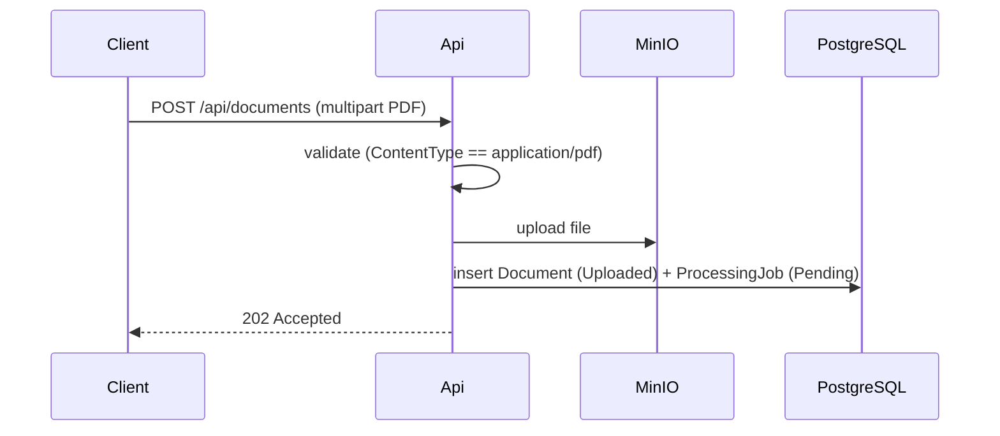
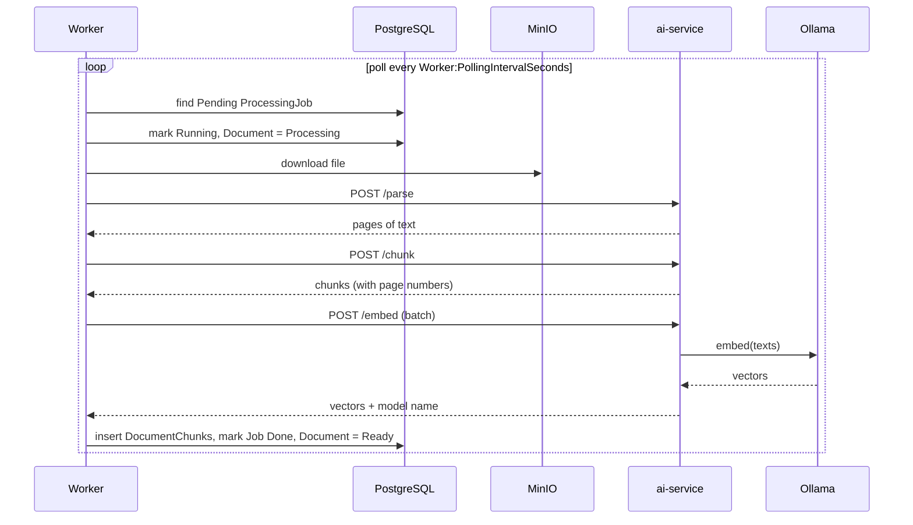
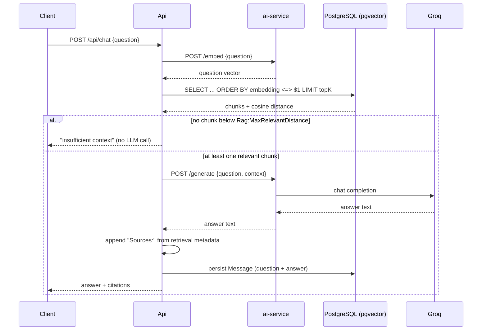
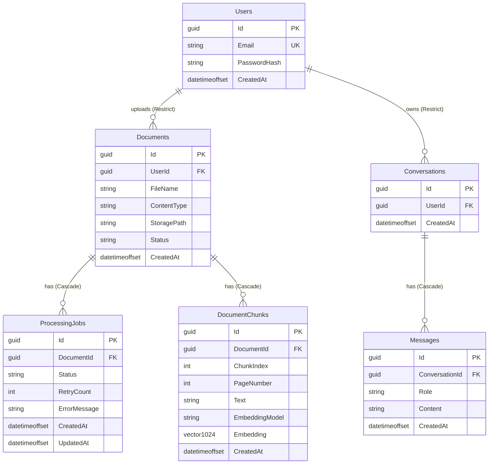

# Architecture

Technical walkthrough of how SmartDoc is put together. For *why* each choice was made, see
the [README](../README.md#why-these-choices) and the individual ADRs in
[`decisions/`](decisions/) — this document is about the *how*: components, data flow, schema,
configuration and deployment as they actually exist today.

## Components

| Component | Responsibility |
|---|---|
| `SmartDoc.Api` | REST API — auth, document CRUD/upload, search, chat. Runs EF Core migrations and seeds the dev user on startup. |
| `SmartDoc.Worker` | `BackgroundService` polling `ProcessingJobs`, drives the parse → chunk → embed pipeline per document. |
| `SmartDoc.Domain` | Entities and their invariants. No infrastructure types leak in here (e.g. embeddings are `float[]`, not `Pgvector.Vector`). |
| `SmartDoc.Application` | Ports (`IFileStorage`, `IAiServiceClient`) — interfaces only, no implementation. |
| `SmartDoc.Infrastructure` | EF Core `DbContext`, entity configurations, `MinioFileStorage`, `AiServiceClient`, `ProcessingJobProcessor`. |
| `ai-service` (Python/FastAPI) | Stateless: `/parse`, `/chunk`, `/embed`, `/generate`. Never touches PostgreSQL. |
| PostgreSQL + pgvector | Transactional data and vector storage/search in one system. |
| MinIO | Original PDF files (S3-compatible API). |
| Ollama | Embedding model (`bge-m3`, multilingual — ADR 0026), runs on the host, not containerized. |
| Groq | Hosted LLM for `/generate`. |

`Api` and `Worker` share `SmartDoc.Infrastructure`/`SmartDoc.Domain`/`SmartDoc.Application`
but are separate deployables/processes — `Api` is user-facing and never does the actual
parse/chunk/embed work itself; `Worker` does the processing and never serves HTTP.

## Data flow

### Document upload



### Background processing



On failure, `ProcessingJob.RecordFailure` decides whether to go back to `Pending` (retry) or
`Failed` (retries exhausted), comparing `RetryCount` against `Worker:MaxRetries`. The
`Document` stays `Processing` while retries are in flight and only flips to `Failed` once the
job gives up — see [ADR 0018](decisions/0018-processing-job-granular-retry.md).

Before the polling loop starts, the Worker also runs `RecoverOrphanedJobsAsync` once: any job
left in `Running` (from a previous Worker process that crashed or was killed) is routed
through the same `RecordFailure` path — `RetryCount` is **not** reset, so a document that
reliably crashes the Worker still converges to `Failed` instead of retrying forever across
restarts. See [ADR 0023](decisions/0023-orphaned-processing-job-recovery.md).

### Chat / RAG



`.NET` runs the similarity search itself via raw SQL (`Database.SqlQuery<T>`, pgvector's
`<=>` cosine-distance operator) rather than through an ORM abstraction — see
[ADR 0016](decisions/0016-similarity-search-and-rag-endpoints.md). There's no interface over
this; it's Postgres-specific SQL with no alternative implementation to abstract for.

## Data model



Notes:

- `Document.UserId → Users.Id` and `Conversation.UserId → Users.Id` are `DeleteBehavior
  .Restrict` — a user can't be deleted out from under their documents/conversations
  silently. `ProcessingJob.DocumentId → Documents.Id` and `Message.ConversationId →
  Conversations.Id` are `Cascade` — neither makes sense without its parent. See
  [ADR 0006](decisions/0006-document-user-relationship.md).
- `Documents` is a shared knowledge base — any authenticated user can see/delete any
  document. `Conversations` are personal — retrieval is always scoped to the owning
  `UserId`. See [ADR 0017](decisions/0017-jwt-auth.md).
- `DocumentChunk.Embedding` is `vector(1024)`, fixed to `bge-m3`'s output dimension (was
  `vector(768)`/`nomic-embed-text` until [ADR 0026](decisions/0026-multilingual-embedding-model.md)
  swapped it for real cross-lingual retrieval) and validated in the domain constructor, not
  just the schema. Each chunk also stores which `EmbeddingModel` produced it — per-chunk, not
  a single global setting — so a future model change doesn't silently mix incompatible
  vectors. See [ADR 0013](decisions/0013-document-chunks-and-worker-wiring.md).
- `DocumentChunks.Embedding` has an HNSW index (`vector_cosine_ops`, matching the `<=>`
  operator used in search) rather than `ivfflat`, because the table starts empty and grows
  incrementally — `ivfflat`'s k-means cluster build needs representative data at
  `CREATE INDEX` time, which an empty/growing table can't provide. See
  [ADR 0019](decisions/0019-pgvector-hnsw-index.md).
- `Status` columns (`Document`, `ProcessingJob`) are persisted as readable strings, not
  integers — a deliberate trade of a few bytes for a database you can read directly.

## Configuration

All runtime configuration is environment-driven — `.env` (see
[`.env.example`](../.env.example), the source of truth) feeds `docker-compose.yml`, which
maps to `Api`/`Worker`'s configuration keys (`ConnectionStrings__Postgres`, `Jwt__*`,
`Minio__*`, `AiService__BaseUrl`, `Worker__*`, `Rag__*`) and `ai-service`'s own env vars
(`OLLAMA_BASE_URL`, `GROQ_API_KEY`, etc.). Containers reference each other by Docker service
name (`postgres`, `minio`, `ai-service`), not `localhost` — `appsettings.Development.json`
(which does use `localhost`) is only relevant when running `Api`/`Worker` loose via
`dotnet run` against the rest of the stack in Docker.

Key tunables and their current values:

| Key | Value | Where |
|---|---|---|
| `Worker:PollingIntervalSeconds` | 5 | how often the Worker checks for new jobs |
| `Worker:MaxRetries` | 3 | retries *after* the initial attempt — a job can run up to 4 times before `Failed` |
| `Rag:DefaultTopK` / `Rag:MaxTopK` | 5 / 50 | chunks retrieved per search/chat request |
| `Rag:MaxRelevantDistance` | 0.5 | cosine distance cutoff, empirically calibrated (ADR 0022, recalibrated for `bge-m3` in ADR 0026) |
| `Jwt:ExpirationMinutes` | see `appsettings*.json` | token lifetime; no revocation list exists |

## Deployment (Docker Compose)

`docker compose up -d` is a complete bootstrap — see
[ADR 0024](decisions/0024-docker-compose-completo.md). Startup is sequenced with
`depends_on: condition: service_healthy`, not just `service_started`:

```
postgres, minio, ai-service (healthy)
        └──> api (runs EF Core migrations + seed, then reports healthy via GET /health)
                └──> worker (only starts once api is healthy, i.e. schema is guaranteed ready)
```

Only `Api` runs `Database.MigrateAsync()` — if both `Api` and `Worker` raced to migrate an
empty database on first boot, that's a concurrency hazard worth avoiding rather than
tolerating. Structured logs from all three custom services are bind-mounted to the host
(`*/logs/`) for inspection without `docker exec`.

Ollama is deliberately **not** containerized — it runs on the physical host and is reached
over the VM's host-only network, so it can use whatever GPU/host acceleration is available
directly rather than being constrained by container passthrough. See
[ADR 0011](decisions/0011-ai-service-scaffold.md)/
[ADR 0012](decisions/0012-embeddings-ollama-provider.md).

## Testing strategy

- **Unit tests** (`SmartDoc.UnitTests`): domain entity invariants (constructors, state
  transitions, validation) with no external dependencies.
- **Integration tests** (`SmartDoc.IntegrationTests`): `WebApplicationFactory<Program>`
  against a real PostgreSQL — not mocked — covering endpoints end-to-end, EF Core
  configuration (unique constraints, FK behavior), and the `ProcessingJobProcessor` pipeline
  including forced-failure/retry/recovery scenarios. Integration tests run sequentially
  (`DisableTestParallelization`) since they share one real database with no per-test
  isolation.
- **`ai-service` tests** (pytest): parsing (including encrypted-PDF edge cases), chunking
  (including the whitespace-only-chunk and infinite-loop regressions from
  [ADR 0021](decisions/0021-ingestion-pipeline-robustness.md)), embedding/LLM provider
  clients.
- **RAG threshold calibration** ([ADR 0022](decisions/0022-rag-threshold-calibration.md)) is
  a separate empirical exercise, not a unit test — a real PDF corpus plus ground-truth
  questions run through `/api/search` to measure actual retrieval distances, not simulated
  ones. The methodology and result are documented in the ADR; the corpus itself is
  gitignored (`calibration/`), not a repo artifact.

122 .NET tests (65 unit + 57 integration) and 23 `ai-service` tests, all currently green
against the real containerized stack.

## Observability

Serilog (`Api`/`Worker`) and a matching JSON file handler (`ai-service`) write to both
console (readable text) and rolling daily JSON files under `logs/` — see
[ADR 0020](decisions/0020-serilog-global-error-handling.md). A dedicated sub-logger isolates
every RAG retrieval's raw cosine `Distance` into `logs/distance-*.log`, separate from the
general application log — this is the actual data source the threshold calibration
(ADR 0022) was built on, not an afterthought added for this document. `GlobalExceptionHandler`
(`IExceptionHandler`) maps `HttpRequestException` (an unreachable `ai-service`/Groq/Ollama)
to `503` and everything else to a generic `500` `ProblemDetails` response, without leaking
`exception.Message` to the client.

## Further reading

- [`../README.md`](../README.md) — project overview, setup instructions, RAG parameters.
- [`decisions/`](decisions/) — the full ADR log, one file per non-trivial decision, in the
  order they were made.
- [`../PROJECT.md`](../PROJECT.md) — the original concept/scope document this project was
  planned against.
